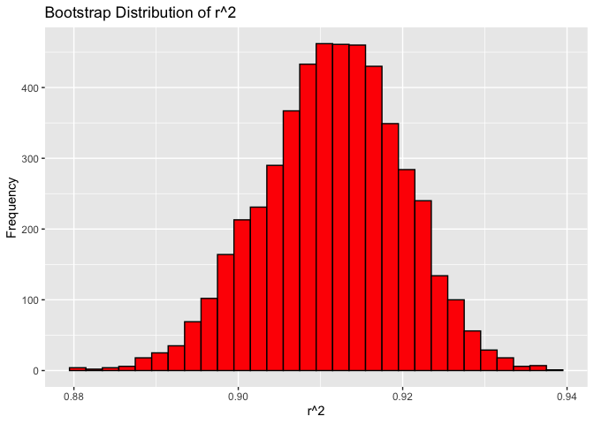
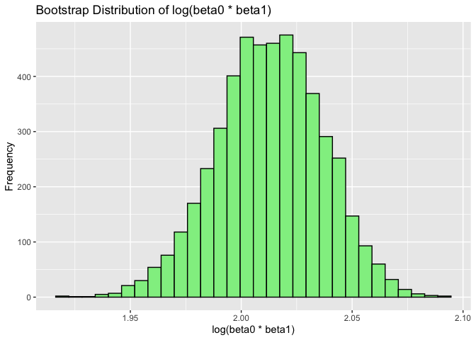
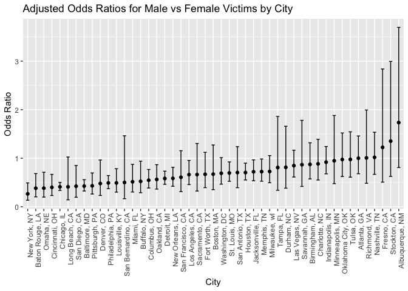
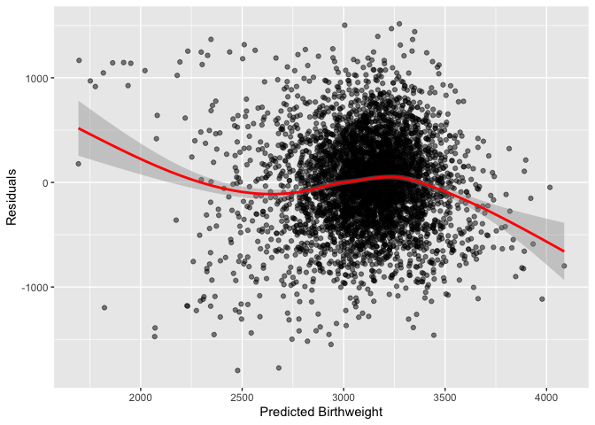
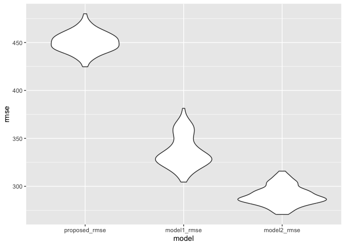

p8105_hw6_yc4617
================
2024-12-02

``` r
# necessary library
library(tidyverse)
```

    ## ── Attaching core tidyverse packages ──────────────────────── tidyverse 2.0.0 ──
    ## ✔ dplyr     1.1.4     ✔ readr     2.1.5
    ## ✔ forcats   1.0.0     ✔ stringr   1.5.1
    ## ✔ ggplot2   3.5.1     ✔ tibble    3.2.1
    ## ✔ lubridate 1.9.3     ✔ tidyr     1.3.1
    ## ✔ purrr     1.0.2     
    ## ── Conflicts ────────────────────────────────────────── tidyverse_conflicts() ──
    ## ✖ dplyr::filter() masks stats::filter()
    ## ✖ dplyr::lag()    masks stats::lag()
    ## ℹ Use the conflicted package (<http://conflicted.r-lib.org/>) to force all conflicts to become errors

``` r
library(dplyr)
library(mgcv)
```

    ## Loading required package: nlme
    ## 
    ## Attaching package: 'nlme'
    ## 
    ## The following object is masked from 'package:dplyr':
    ## 
    ##     collapse
    ## 
    ## This is mgcv 1.9-1. For overview type 'help("mgcv-package")'.

``` r
library(modelr)
library(SemiPar)
set.seed(123)
```

# Problem 1

``` r
weather_df = 
  rnoaa::meteo_pull_monitors(
    c("USW00094728"),
    var = c("PRCP", "TMIN", "TMAX"), 
    date_min = "2017-01-01",
    date_max = "2017-12-31") %>%
  mutate(
    name = recode(id, USW00094728 = "CentralPark_NY"),
    tmin = tmin / 10,
    tmax = tmax / 10) %>%
  select(name, id, everything())
```

    ## using cached file: /Users/kakashi/Library/Caches/org.R-project.R/R/rnoaa/noaa_ghcnd/USW00094728.dly

    ## date created (size, mb): 2024-09-26 10:33:49.194839 (8.651)

    ## file min/max dates: 1869-01-01 / 2024-09-30

``` r
samp_result = weather_df |>
  modelr::bootstrap(n = 5000) |> 
  mutate(
    models = map(strap, ~ lm(tmax ~ tmin, data = .x)),
    r_squared = map_dbl(models, ~ broom::glance(.x)$r.squared),
    log_beta_product = map_dbl(models, ~ {
      beta <- coef(.x)
      log(beta[1] * beta[2])
    })
  )|>
  select(r_squared,log_beta_product)
```

``` r
ggplot(samp_result,aes(x = r_squared)) +
  geom_histogram(bins = 30, fill = "red", color = "black") +
  labs(title = "Bootstrap Distribution of r^2", x = "r^2", y = "Frequency")
```

<!-- --> The
R-square values are centered around approximately 0.91, indicating that,
on average, the model explains about 91% of the variance in the response
variable (e.g., birthweight).The distribution is symmetric and
bell-shaped, resembling a normal distribution. This suggests that the
R-square values are stable across different bootstrap samples, implying
a robust model fit.

``` r
ggplot(samp_result, aes(x = log_beta_product)) +
  geom_histogram(bins = 30, fill = "lightgreen", color = "black") +
  labs(title = "Bootstrap Distribution of log(beta0 * beta1)", x = "log(beta0 * beta1)", y = "Frequency")
```

<!-- --> The
distribution is approximately symmetric and bell-shaped, resembling a
normal distribution. This suggests that the product beta0 and beta1 (on
a logarithmic scale) is stable across different bootstrap samples.

``` r
ci_r_squared <- quantile(samp_result$r_squared, probs = c(0.025, 0.975))
ci_log_beta_product <- quantile(samp_result$log_beta_product, probs = c(0.025, 0.975))
cat("Confidence Interval of r-squared is",ci_r_squared,"\n")
```

    ## Confidence Interval of r-squared is 0.8945701 0.9271042

``` r
cat("Confidence Interval of log beta product is",ci_log_beta_product)
```

    ## Confidence Interval of log beta product is 1.964166 2.058364

# Problem 2

``` r
homicide_data = read.csv("homicide-data.csv")|>
   mutate(city_state = paste(city, state, sep = ", "),
          resolved = as.numeric(disposition == "Closed by arrest"),
          victim_age = as.numeric(victim_age)
          )|>
  filter(
    !city_state %in% c("Dallas, TX", "Phoenix, AZ", "Kansas City, MO", "Tulsa, AL"),
    victim_race %in% c("White", "Black"),
    !is.na(victim_age),
    !is.na(lat),
    !is.na(lon)
  )
```

``` r
# Run for Baltimore
baltimore_data = homicide_data |>
  filter(city_state == "Baltimore, MD")
baltimore_model = glm(resolved ~ victim_age + victim_sex + victim_race,
                       data = baltimore_data, family = "binomial")
save(baltimore_model, file = "baltimore_model.RData")
baltimore_results <- broom::tidy(baltimore_model, exponentiate = TRUE, conf.int = TRUE)
# estimate and confidence interval for sex
baltimore_results %>%
  filter(term == "victim_sexMale") %>%
  select(estimate, conf.low, conf.high)
```

    ## # A tibble: 1 × 3
    ##   estimate conf.low conf.high
    ##      <dbl>    <dbl>     <dbl>
    ## 1    0.426    0.324     0.558

``` r
# This indicates that male victims are less likely than female victims to have their homicide cases resolved, holding other variables constant (age and race).
```

``` r
# Run for all cities
city_results = homicide_data |>
  group_by(city_state) |>
  nest() |>
  mutate(
    models = map(data, ~ glm(resolved ~ victim_age + victim_sex + victim_race,
                             data = .x, family = "binomial")),
    results = map(models, ~ broom::tidy(.x, exponentiate = TRUE, conf.int = TRUE))
  )|>
  unnest(results)|>
  select(-data,-models)|>
  filter(term == "victim_sexMale")  
city_results
```

    ## # A tibble: 47 × 8
    ## # Groups:   city_state [47]
    ##    city_state     term  estimate std.error statistic  p.value conf.low conf.high
    ##    <chr>          <chr>    <dbl>     <dbl>     <dbl>    <dbl>    <dbl>     <dbl>
    ##  1 Albuquerque, … vict…    1.73      0.386  1.43     1.54e- 1    0.808     3.70 
    ##  2 Atlanta, GA    vict…    1.00      0.194  0.000397 1.00e+ 0    0.680     1.46 
    ##  3 Baltimore, MD  vict…    0.426     0.138 -6.18     6.26e-10    0.324     0.558
    ##  4 Baton Rouge, … vict…    0.381     0.306 -3.15     1.65e- 3    0.204     0.684
    ##  5 Birmingham, AL vict…    0.873     0.212 -0.641    5.21e- 1    0.573     1.32 
    ##  6 Boston, MA     vict…    0.672     0.326 -1.22     2.22e- 1    0.352     1.27 
    ##  7 Buffalo, NY    vict…    0.522     0.299 -2.17     2.98e- 2    0.289     0.939
    ##  8 Charlotte, NC  vict…    0.884     0.236 -0.524    6.00e- 1    0.551     1.39 
    ##  9 Chicago, IL    vict…    0.410     0.102 -8.77     1.86e-18    0.336     0.501
    ## 10 Cincinnati, OH vict…    0.400     0.269 -3.41     6.49e- 4    0.231     0.667
    ## # ℹ 37 more rows

``` r
# Create a plot of odds ratios by city
ggplot(city_results, aes(x = reorder(city_state, estimate), y = estimate)) +
  geom_point() +
  geom_errorbar(aes(ymin = conf.low, ymax = conf.high), width = 0.4) +
  labs(title = "Adjusted Odds Ratios for Male vs Female Victims by City",
       x = "City", y = "Odds Ratio") +
  theme(axis.text.x = element_text(angle = 90, hjust = 1))
```

<!-- --> In
this plot, we can see the odds ratios vary significantly among cities,
suggesting that the likelihood of solving homicides involving male
victims relative to female victims depends on the city. In most cities,
the odds ratios are less than 1, implying that male victims are less
likely to have their cases solved compared to female victims. A few
cities, such as Stockton, CA, and Minneapolis, MN, show extremely high
ORs with large confidence intervals, possibly indicating unique local
factors or outlier cases influencing the results.

# Problem 3

``` r
birthweight_df = read.csv("birthweight.csv")|>
  mutate(
    babysex = case_when(
      babysex == 1 ~ "Male",
      babysex == 2 ~ "Female"),
    frace = case_when(
      frace == 1 ~ "White",
      frace == 2 ~ "Black",
      frace == 3 ~ "Asian",
      frace == 4 ~ "Puerto Rican",
      frace == 8 ~ "Other",
      TRUE ~ NA),
    mrace = case_when(
      mrace == 1 ~ "White",
      mrace == 2 ~ "Black",
      mrace == 3 ~ "Asian",
      mrace == 4 ~ "Puerto Rican",
      mrace == 8 ~ "Other",
      TRUE ~ NA),
    malform = case_when(
      malform == 0 ~ "Absent",
      malform == 1 ~ "Present",
      TRUE ~ NA)) |>
  drop_na()
```

``` r
set.seed(123)
train_indices <- sample(nrow(birthweight_df), 0.8 * nrow(birthweight_df))
train_data <- birthweight_df[train_indices, ]
test_data <- birthweight_df[-train_indices, ]
```

``` r
cv_df =
  crossv_mc(birthweight_df, 100) |> 
  mutate(
    train = map(train, as_tibble),
    test = map(test, as_tibble))
```

My proposed model is using gestational age in weeks, presence of
malformations that could affect weight, mother’s age at delivery
(years), number of live births prior to this pregnancy, average number
of cigarettes smoked per day during pregnancy, mother’s weight gain
during pregnancy (pounds)) as predictors.

``` r
proposed_model <- lm(
  bwt ~ gaweeks + malform  + momage + parity + smoken + wtgain ,
  data = birthweight_df
)
cv_df = cv_df |>
  mutate(
    proposed_model = map(train, \(df) lm(
      bwt ~ gaweeks + malform  + momage + parity + smoken + wtgain ,
      data = df
    )),
    model1 = map(train, \(df) lm(bwt ~ blength + gaweeks, data = df)),
    model2 = map(train, \(df) lm(bwt ~ bhead * blength * babysex, data = df)),
    proposed_rmse = map2_dbl(proposed_model, test, \(mod, df) rmse(model = mod, data = df)),
    model1_rmse = map2_dbl(model1, test, \(mod, df) rmse(model = mod, data = df)),
    model2_rmse = map2_dbl(model2, test, \(mod, df) rmse(model = mod, data = df))
  )
```

``` r
birthweight_df|>
  add_predictions(proposed_model, var = "predicted_bwt") %>%
  add_residuals(proposed_model, var = "residuals")%>%
  ggplot(aes(x = predicted_bwt, y = residuals))+
  geom_point(alpha = 0.5) +
  geom_smooth(col = "red") +
  labs(x = "Predicted Birthweight", y = "Residuals")
```

    ## `geom_smooth()` using method = 'gam' and formula = 'y ~ s(x, bs = "cs")'

<!-- -->
The residuals are generally centered around zero, which is a desirable
property indicating that the model does not systematically overpredict
or underpredict across the range of predicted values.

``` r
cv_df |> 
  select(ends_with("rmse")) |> 
  pivot_longer(
    everything(),
    names_to = "model", 
    values_to = "rmse",
    names_prefix = "rmse_") |> 
  mutate(model = fct_inorder(model)) |> 
  ggplot(aes(x = model, y = rmse)) + geom_violin()
```

<!-- -->
